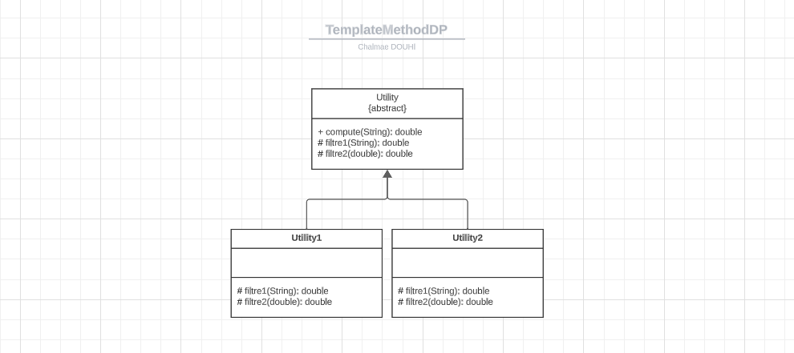
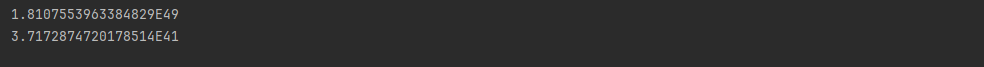

## Template method pattern

### Description
The template method pattern is a behavioral design pattern that defines the program skeleton of an algorithm in an operation, deferring some steps to subclasses. It lets one redefine certain steps of an algorithm without changing the algorithm's structure.

### Application


### Implementation
* Utility class
```java
public abstract class Utility {

    public double compute(String str) {
        int size = str.length();
        double result = 0;
        for (int i = 0; i < size; i++) {
            double x = filtre1(str);
            result += i * x;
            double y = filtre2(result);
            result += y * result;
        }
        return result;
    }


    protected abstract double filtre1(String str);

    protected abstract double filtre2(double number);
}
```
* UtilityImpl1 class
```java
public class UtilityImpl1 extends Utility {
    @Override
    protected double filtre1(String str) {
        return Math.pow(str.length(), 4);
    }

    @Override
    protected double filtre2(double number) {
        return number * 2;
    }
}    
```
* UtilityImpl2 class
```java
public class UtilityImpl2 extends Utility {
    @Override
    protected double filtre1(String str) {
        return Math.pow(str.length(), 2);
    }

    @Override
    protected double filtre2(double number) {
        return number * 19;
    }
}
```
* Main class
```java
public class Test {
    public static void main(String[] args) {
        Utility utility1 = new UtilityImpl1();
        System.out.println(utility1.compute("douhi"));
        utility1 = new UtilityImpl2();
        System.out.println(utility1.compute("douhi"));
    }
}
```
### Output


### Conclusion
The template method pattern is a behavioral design pattern that defines the program skeleton of an algorithm in an operation, deferring some steps to subclasses. It lets one redefine certain steps of an algorithm without changing the algorithm's structure.


